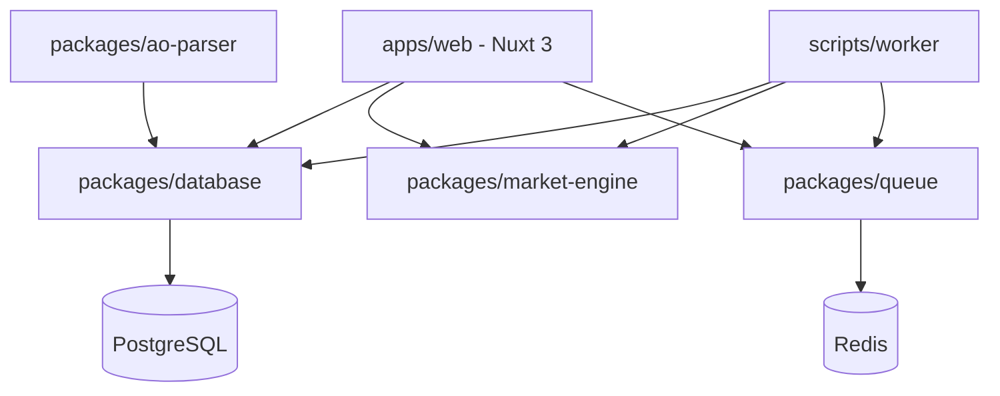

# Project Architecture

Albion Tool is built as a high-performance, modular monorepo designed to handle large volumes of game data and real-time market updates.

## Monorepo Overview

We use **pnpm workspaces** and **Turborepo** to manage our packages and applications efficiently.

### Components

- **`apps/web`**: The flagship Nuxt 3 application. It serves as both the frontend (Vue 3) and the backend API (Nitro).
- **`packages/database`**: Centralized Prisma schema and client. This ensures type-safe database access across all apps and scripts.
- **`packages/market-engine`**: The core logic for interacting with the Albion Online Data Project, calculating profitability, and managing price history.
- **`packages/ao-parser`**: Responsible for fetching and normalizing raw game data from `ao-bin-dumps`.
- **`packages/queue`**: BullMQ configurations for background tasks like market syncing and data imports.
- **`packages/types`**: Shared TypeScript interfaces, enums, and contracts.

---

## Data Ingestion Pipeline

The project relies on two main data streams:

### 1. Static Game Data (AO-Bin-Dumps)
Handled by `packages/ao-parser`. It fetches raw JSON data from the official dumps, normalizes it into our internal format, and pushes it to PostgreSQL.
- **Flow**: `JSON Dumps` -> `ao-parser` -> `Normalization` -> `Prisma` -> `PostgreSQL`

### 2. Live Market Data (Albion Data Project)
Handled by `packages/market-engine` and `packages/queue`.
- **Flow**: `Schedule` -> `BullMQ` -> `Market Service` -> `API Request (Batch of 200)` -> `Price History / Live Updates`

---

## Technical Stack

- **Runtime**: Node.js 22+
- **Framework**: Nuxt 3 (Fullstack)
- **Database**: PostgreSQL with Prisma ORM
- **Caching/Queue**: Redis with BullMQ
- **Styling**: Tailwind CSS
- **Testing**: Vitest
- **Containers**: Docker & Docker Compose
